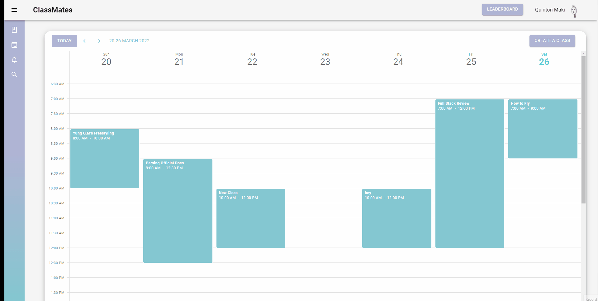
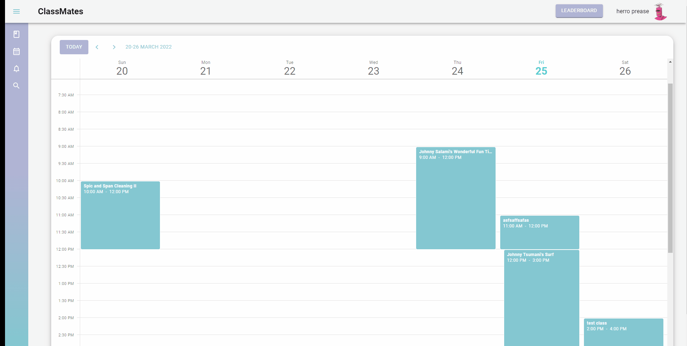

This is a [Next.js](https://nextjs.org/) project bootstrapped with [`create-next-app`](https://github.com/vercel/next.js/tree/canary/packages/create-next-app).

# ClassMates

## Table of Contents
- [Getting Started](#getting-started)
  - [1. Installing Dependencies](#1-installing-dependencies)
  - [2. Running the Project](#2-running-the-project)
  - [3. Setting Up Firebase Authentication](#3-setting-up-firebase-authentication)
  - [4. Setting Up Firebase Firestore Database](#4-setting-up-firebase-firestore-database)
  - [5. Deploy on Vercel](#5-deploy-on-vercel)
- [Project Details](#project-details)
- [Code Structure](#code-structure)
- [Contributers](#contributors)
- [How to Contribute](#how-to-contribute)

## Getting Started
Hello World! ヾ(☆◡☆) This is a mentorship-based remote learning platform that will connect mentors and mentees around the world. There isn’t a current one-stop shop that allows mentors to create and schedule classes and mentees to search, browse and sign up for classes that they might have not been able to access in-person. By providing a portal for mentors/mentees to interact easily, we’re making remote learning more accessible and seamless.

### 1. Installing Dependencies
#### Built With


#### How to Install Dependencies
```bash
npm install
```

### 2. Running the Project
Runs development server:
```bash
npm run dev
# or
yarn dev
```
The application will be running on [http://localhost:3000](http://localhost:3000).
This script will also run webpack and auto refresh the page whenever you make changes.
<br/>
WOOHOO! ٩(๑˃́ꇴ˂̀๑)۶ If everything went as expected, you should have the project running on your local machine.

### 3. Setting Up Firebase Authentication
Create a Firebase Account and Login then Go To Console


Secondly Create a New Project and add the information to a .env
```json
"NEXT_PUBLIC_FIREBASE_API_KEY"="API_KEY"
"NEXT_PUBLIC_FIREBASE_AUTH_DOMAIN"="AUTH_DOMAIN"
"NEXT_PUBLIC_FIREBASE_PROJECT_ID"="PROJECT_ID"
"NEXT_PUBLIC_FIREBASE_STORAGE_BUCKET"="STORAGE_BUCKET"
"NEXT_PUBLIC_FIREBASE_MESSAGING_SENDER_ID"="SENDER_ID"
"NEXT_PUBLIC_FIREBASE_APP_ID"="APP_ID"
```
Next import your .env information into a SDK setup
* Example
 [Firebase Get Started](https://firebase.google.com/docs/auth/web/start)

### 4. Setting Up Firebase Firestore Database
#### API Routes & Endpoints
All API routes are in `pages/api/`.

<details>
<summary>View Courses Endpoints</summary>

`GET /api/courses` Retrieves list of all courses.

| Parameter         | Type    | Description                                            |
| ----------------- | ------- | ------------------------------------------------------ |
| none              | none    | 'Mentor' or 'Mentee'                                   |

`GET/api/courses/index.js` Retrieves list of all courses.

| Parameter | Type    | Description                                                    |
| --------- | ------- | -------------------------------------------------------------- |
| none      | none    | none                                                           |

`POST/api/courses/index.js` Adds a new course.

| Body Parameter   | Type    | Description                                             |
| ---------------- | ------- | ------------------------------------------------------- |
| name             | string  | Ex: "Intro to Computer Science"                         |
| subject          | string  | Ex: "Science", "Math", "Literature", "Language"         |
| description      | string  | Ex: "Computer Science basics and history"               |
| capacity         | number  | Ex: 25                                                  |
| start_date       | string  | Ex: "2022-03-28T10:30:00.000Z"                          |
| end_date         | string  | Ex: "2022-03-28T12:30:00.000Z"                          |
| meeting_url      | string  | Ex: "zoom.com/meeting_path"                             |
| mentorId         | string  | Required unique user id generated at sign up            |
| mentorFirstName  | string  | Ex: "Cornie"                                            |
| mentorLastName   | string  | Ex: "Jacobs"                                            |

`GET/api/courses/[course_id]` Retrieves course info for a specific user.

| Parameter | Type    | Description                                                    |
| --------- | ------- | -------------------------------------------------------------- |
| none      | none    | none                                                           |

`PUT/api/courses/[course_id]` Removed mentee from course.

| Body Parameter   | Type    | Description                                             |
| ---------------- | ------- | ------------------------------------------------------- |
| mentees          | object  | {id: string}                                            |

`PUT/api/courses/[course_id]` Removed course from course catalog and my courses list.

| Parameter | Type    | Description                                                    |
| --------- | ------- | -------------------------------------------------------------- |
| none      | none    | none                                                           |

`GET/api/courses/mentees/[mentee_id]` Retrieves courses for a specific mentee.

| Parameter | Type    | Description                                                    |
| --------- | ------- | -------------------------------------------------------------- |
| none      | none    | none                                                           |

`GET/api/courses/mentors/[mentor_id]` Retrieves courses for a specific mentor.

| Parameter | Type    | Description                                                    |
| --------- | ------- | -------------------------------------------------------------- |
| none      | none    | none                                                           |

`GET /api/courses/subjects/` Retrieves list of all subjects.

| Parameter         | Type    | Description                                            |
| ----------------- | ------- | ------------------------------------------------------ |
| none              | none    | none                                                   |

`GET /api/courses/subjects/[subject_name]` Retrieves list of courses by subject name

| Parameter         | Type    | Description                                            |
| ----------------- | ------- | ------------------------------------------------------ |
| subject_names     | string  | 'Science', 'Literature, 'History', 'Language', 'Math'  |

`PUT /api/courses/course/[course_id]` Adds mentee to course.

| Parameter      | Type    | Description                                               |
| -------------- | ------- | --------------------------------------------------------- |
| course_id      | string  | Required unique user id generated at sign up              |

| Body Parameter   | Type    | Description                                             |
| ---------------- | ------- | ------------------------------------------------------- |
| mentee_id        | string  | Required unique mentee id to be added to course         |
| mentee_firstName | string  | Ex: "Jeth"                                              |
| mentee_lastName  | string  | Ex: "Venturoli"                                         |

</details>
<details>
<summary>View Users Endpoints</summary>

`GET /api/users/[user_id]` Retrieves info for specific user.

| Parameter      | Type    | Description                                               |
| -------------- | ------- | --------------------------------------------------------- |
| user_id        | string  | Required unique id for specific user                      |

`POST /api/users` Adds new user.

| Body Parameter | Type    | Description                                               |
| -------------- | ------- | --------------------------------------------------------- |
| username       | string  | Ex: "ucoleya                                              |
| firstName      | string  | Ex: "Jeth"                                                |
| lastName       | string  | Ex: "Venturoli"                                           |
| uid            | string  | Required unique user id generated at sign up              |
| account_type   | string  | "Mentee" or "Mentor"                                      |

`PUT /api/users/[user_id]` Updates user's description.

| Parameter      | Type    | Description                                               |
| -------------- | ------- | --------------------------------------------------------- |
| user_id        | string  | Required unique user id generated at sign up              |

| Body Parameter | Type    | Description                                               |
| -------------- | ------- | --------------------------------------------------------- |
| description    | string  | "Javascript Lover"                                        |

</details>
<details>
<summary>View Endorsements Endpoints</summary>

`GET /api/endorsements` Retrieves top 10 endorsements.

| Parameter      | Type    | Description                                               |
| -------------- | ------- | --------------------------------------------------------- |
| none           | none    | none                                                      |

`GET /api/endorsements/users/[user_id]` Retrieves endorsement count for specific user.

| Parameter      | Type    | Description                                               |
| -------------- | ------- | --------------------------------------------------------- |
| user_id        | string  | Required unique user id generated at sign up              |

`PUT /api/endorsements/users/[user_id]` Updates endorsement count for specific user.

| Parameter      | Type    | Description                                               |
| -------------- | ------- | --------------------------------------------------------- |
| user_id        | string  | Required unique user id generated at sign up              |

| Body Parameter | Type    | Description                                               |
| -------------- | ------- | --------------------------------------------------------- |
| type           | string  | "increase" or "decrease"                                  |

`PUT /api/endorsements/courses/[course_id]` Updates endorsement count for specific course

| Parameter      | Type    | Description                                               |
| -------------- | ------- | --------------------------------------------------------- |
| course_id      | string  | Required unique course id generated at sign up            |

| Body Parameter | Type    | Description                                               |
| -------------- | ------- | --------------------------------------------------------- |
| type           | string  | "increase" or "decrease"                                  |

</details>


### 5. Deploy on Vercel
The easiest way to deploy your Next.js app is to use the [Vercel Platform](https://vercel.com/new?utm_medium=default-template&filter=next.js&utm_source=create-next-app&utm_campaign=create-next-app-readme) from the creators of Next.js.
Check out our [Next.js deployment documentation](https://nextjs.org/docs/deployment) for more details.

## Project Details
### Signup/Login

* Login Page


* Signup Page


### Navigation Bar
<details>
<summary>
<h3> Calendar </h3>
</summary>
This page displays the calendar view of courses with appointment blocks. The page will dynamically render based on mentor/mentee account type, displaying only the classes they are teaching or enrolled in. You can create/edit/delete classes directly on the calendar page.

**Display Info and Link to Room**



**Creating Course**


**Deleting Courses**


**Editing Courses**


</details>

### Leaderboard
### Profile Page
<details>
This page displays the current or selected user's full name, account type, location, and profile description.
On the current user's profile page, the user can edit profile description. A mentor can see their own recommendation count and can recommend other mentees.
A mentee can see other mentors' profiles and their recommendation counts but can't see their own recommendation counts.

**My Profile**


**Selected Profile**


</details>

### Notifications

## Code Structure
Now that you have an overall understanding of the project we can dicusss how the code is structured.

`/pages`: Contains all our pages with dynamic routes.
<br/>
`/pages/api`: Contains functions to call APIs.file or a file with the same name as the directory.
<br/>
`/utils`: Contains util files such as our API configuration files, util helper functions and styling.
<br/>
`/utils/context/AuthProvider`: Contains auth configuration.

## Contributors
* [Alex Hu](https://github.com/gunpowder66)
* [Chris Josephs](https://github.com/cmjosephs)
* [Estevan Gonzalez](https://github.com/GonzalezEstevan)
* [Kevin Kim](https://github.com/kevinhwkim)
* [Matthew Chang](https://github.com/changerbang)
* [Samantha Pham](https://github.com/samanthavpham)
* [Teresa Lew](https://github.com/teresal92)
* [Tiffany Vu](https://github.com/tiffanyyv)
* [Tristen Urban](https://github.com/TristenUrban)

## How to Contribute
Please follow feature branch workflow and the guide outlined in the google drive. For all pull request please tag Chris (cmjosephs) and another member working on a similar module for code review and pull request approval.

## Learn More
To learn more about Next.js, take a look at the following resources:
- [Next.js Documentation](https://nextjs.org/docs) - learn about Next.js features and API.
- [Learn Next.js](https://nextjs.org/learn) - an interactive Next.js tutorial.
- You can check out [the Next.js GitHub repository](https://github.com/vercel/next.js/)
<br/>
To learn more about Firebase, take a look at the following resources:

- [Firebase Documentation](https://firebase.google.com/docs) - learn about Firebase fundamentals.
- [Firebase Demo](https://console.firebase.google.com/project/fir-demo-project/overview) - view a Firebase demo.
